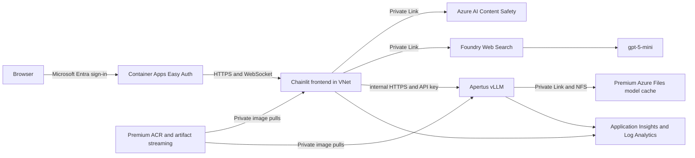

<p align="center">
	<picture>
		<source media="(prefers-color-scheme: dark)" srcset="src/frontend/public/logo_dark.png">
		
	</picture>
</p>

# How to Run Apertus 1.5 8B on Microsoft Azure

Deploy `swiss-ai/Apertus-v1.5-8B` on an Azure Container Apps serverless A100
with a separate Entra-authenticated Chainlit frontend. The frontend requires
Azure AI Content Safety approval and cited Microsoft Foundry Web Search evidence
before every model call. The vLLM app has internal-only ingress. The environment
runs in a custom VNet and reaches model storage, Key Vault, Foundry, Content
Safety, and ACR image pulls through private endpoints.

> This repository is deployed in the `cloudcherry-prod` subscription under
> `rg-cloudcherry-apertus`. Running another `azd up` updates billable Azure
> resources. ACR artifact streaming and Content Safety Groundedness Detection
> are preview features.

## Live Deployment

The verified development deployment is available at:

**https://ca-apertus-dev-frontend.greenfield-03ce481d.swedencentral.azurecontainerapps.io/**

Microsoft Entra sign-in is required. Public health endpoints return `200`, the
application root redirects to the tenant login endpoint, and the private
inference endpoint is not internet-accessible. On 2026-07-30, live verification
confirmed:

- Healthy frontend and inference revisions.
- Apertus generation returned `APERTUS_OK` through the private vLLM endpoint.
- NVIDIA A100 80GB, driver `580.105.08`, and CUDA 13 compatibility.
- One active A100 replica against an environment quota of two.
- Private endpoints approved for ACR, Azure Files, Key Vault, Foundry, and
	Content Safety.
- ACR, Azure Files, and Key Vault returned to private/no-shared-key posture
	after deployment.

## Run Apertus on Microsoft Azure

This repository is a deployable Azure quickstart for the Swiss National AI
Initiative's Apertus model. It implements the Azure Container Apps serverless
GPU option end to end: model serving, a branded conversational frontend,
grounding, safety controls, identity, observability, cost controls, and azd
automation.

Apertus and the surrounding Azure services continue to evolve. Treat this as
living documentation, pin model and image revisions, and open an issue or pull
request when platform behavior changes.

## Architecture



The `Tools` and `Thinking` profiles use the same vLLM endpoint. `Tools` allows
additional cited searches. `Thinking` enables the Apertus reasoning parser and
does not expose model-initiated tools. Both always run mandatory pre-grounding.

## What is Apertus?

Apertus, Latin for "open," is Switzerland's open multilingual language-model
family from the [Swiss National AI Initiative](https://swiss-ai.org). Its
training corpus spans about 15 trillion tokens and more than 1,000 languages,
with roughly 40% non-English data. That emphasis includes historically
underrepresented languages such as Swiss German and Romansh. Architecture,
weights, training-data documentation, and recipes are openly published.

<p align="center">
	
	
	
	
</p>

The model is intended as a transparent building block for multilingual
assistants, translation, education, research, and other applications where open
weights and documented provenance matter.

## Deployment Instructions

The upstream quickstart presents several Azure hosting models. Choose according
to the required balance of platform management, scheduling control, and model
scale:

| Azure host | Model variants | Typical fit | Status in this repository |
| --- | --- | --- | --- |
| GPU virtual machines | 8B and 70B-class models | Maximum host-level control and direct GPU administration | Refer to the upstream quickstart |
| Azure Container Apps serverless GPU | 8B | Managed, event-driven serving with scale-to-zero | Implemented and deployed |
| Azure Kubernetes Service GPU node pools | 8B and 70B-class models | Multi-model platforms and advanced scheduling | Refer to the upstream quickstart |

This summary is adapted from the
[Azure Samples Swiss LLM quickstart](https://github.com/Azure-Samples/swiss-llm-quickstart/tree/feature/frontend)
and should be read with the current
[Apertus 1.5 model card](https://huggingface.co/swiss-ai/Apertus-v1.5-8B).

## Branded Chainlit Experience

The frontend uses the upstream Apertus/Azure light and dark logos, favicon,
Swiss flag, and ideation, learning, and writing illustrations. Chainlit loads
them from its documented `src/frontend/public/` directory. The included theme
adds an Azure/Swiss palette, responsive logo sizing, custom starter icons, and a
mobile-safe layout.

The four starter experiences are:

- Morning routine ideation.
- A multilingual high-school explanation of gravity.
- Current Swiss Bundesrat membership.
- A short, casual wedding plus-one invitation.

## Prerequisites

- Azure CLI 2.54 or newer, Azure Developer CLI, Git, and OpenSSL on POSIX.
- An Azure subscription where you can create resources and role assignments.
- `Consumption-GPU-NC24-A100` quota in Sweden Central.
- Data Zone Standard quota for `gpt-5-mini` in Sweden Central.
- A Hugging Face account that accepted the Apertus terms and a read-only token.
- A single-tenant Microsoft Entra app registration and permission to update its
	redirect URI. Its client secret is copied into Key Vault and then cleared from
	the local azd environment.
- An operations email address for Azure Monitor and budget notifications.
- Review and accept the Grounding with Bing data-boundary terms. Search data can
	leave Azure compliance and geographic boundaries and is not covered by the
	Microsoft DPA.
- Confirm the Sweden Central Container Apps GPU fleet supports driver 580 and
	CUDA 13 for the pinned Swiss AI runtime before serving production traffic.
- Permission to create a VNet, private endpoints, private DNS zones, and role
	assignments in `rg-cloudcherry-apertus`.

## Deploy

Authenticate and create an azd environment:

```powershell
az login
azd auth login

$tenantId = az account show --query tenantId -o tsv
$clientId = az ad app create --display-name apertus-chainlit --sign-in-audience AzureADMyOrg --query appId -o tsv
az ad sp create --id $clientId
$clientSecret = az ad app credential reset --id $clientId --display-name apertus-container-app --query password -o tsv

azd env new apertus-dev
azd env set AZURE_SUBSCRIPTION_ID <subscription-id>
azd env set AZURE_RESOURCE_GROUP rg-cloudcherry-apertus
azd env set AZURE_LOCATION swedencentral
azd env set APERTUS_MODEL_REVISION <hugging-face-commit-sha>
azd env set ACCEPT_APERTUS_LICENSE true
azd env set ACCEPT_BING_GROUNDING_TERMS true
azd env set HF_TOKEN <read-only-hugging-face-token>
azd env set ENTRA_TENANT_ID $tenantId
azd env set ENTRA_CLIENT_ID $clientId
azd env set ENTRA_CLIENT_SECRET $clientSecret
azd env set ALERT_EMAIL <operations-email>
azd env set MONTHLY_BUDGET_AMOUNT 500
azd up
```

The Hugging Face and Entra secrets are stored only in the ignored local azd
environment long enough to pass them as secure ARM parameters. ARM creates the
private Key Vault secrets; no deployment hook opens the vault or uses its public
data plane. Postprovision clears the Hugging Face, Entra, and generated vLLM
values, while postdeploy clears the health token after prewarm. Existing secrets
are preserved on later runs. Set `ROTATE_APPLICATION_SECRETS=true` and provide
fresh source credentials only during an intentional rotation. Never pass literal
secrets in a committed parameter file.

The deployment hook remotely builds the inference image in ACR, then enables
and verifies artifact-stream conversion for its tag. A conversion failure or
timeout is fatal and occurs before inference image promotion. After that gate,
the hook configures Easy Auth and registers its generated callback URI. Then azd
builds and deploys the frontend as a conventional Docker service; postdeploy
enables external ingress only after the real image is active.

## Subscription Governance

The deployment is designed for the inherited MCAPSGov controls in
`cloudcherry-prod`:

- Storage shared-key authorization is disabled.
- Storage and Key Vault public network access are disabled.
- Blob anonymous access and Cognitive Services local authentication are disabled.
- Foundry and Content Safety use private endpoints and managed identity.
- Azure Files uses Premium NFS through a private endpoint because ACA SMB mounts
	require a storage key and cannot comply with the shared-key policy.
- ACR is private and export-disabled at rest. Postprovision opens a short
	authenticated public build window for Microsoft-hosted ACR Tasks and azd;
	postdeploy closes it before frontend exposure. Admin and anonymous access stay
	disabled. The deployer receives scoped `AcrPush`, application identities
	receive only `AcrPull`, and runtime pulls resolve through the VNet private
	endpoint.

NFS traffic is network-authenticated and isolated to the VNet/private endpoint.
ACA does not currently expose the AZNFS TLS wrapper for environment mounts, so
this cache path relies on Azure private networking and platform encryption in
transit rather than application-managed NFS TLS.

## Validate Locally

```powershell
Set-Location src/frontend
uv sync --dev
uv run pytest
uv run python -m compileall app.py apertus_frontend
Set-Location ../..
az bicep build --file infra/main.bicep
bash -n infra/hooks/*.sh src/inference/docker-entrypoint.sh
bash infra/hooks/tests/postprovision-test.sh
```

Build checks:

```powershell
docker build --check --file src/frontend/Dockerfile src/frontend
docker build --check --file src/inference/Dockerfile src/inference
docker build --tag apertus-frontend:local src/frontend
```

Running the frontend locally requires endpoints and credentials for Content
Safety, Foundry, and an OpenAI-compatible Apertus server. See
[src/frontend/README.md](src/frontend/README.md).

## Safety Boundary

Text and images are screened before inference. Web evidence is required, cited,
and screened for indirect prompt injection. Generated text is screened and, for
English, checked for groundedness before it is shown. Any dependency failure,
unsafe result, empty evidence, invalid citations, or ungrounded result stops the
request.

Raw audio is the explicit exception: MIME type and size are validated, but its
spoken content is sent to Apertus without Content Safety moderation. Do not
enable audio for a policy domain that requires audio moderation.

Model responses are streamed from vLLM into a server-side buffer. Chainlit only
streams the approved final answer to the browser after output safety and
groundedness checks, preventing unsafe partial output disclosure.

## Operations

- [Architecture](docs/architecture.md)
- [Operations, quota, cost, rollback, and cleanup](docs/operations.md)
- [Security and grounding](docs/security-and-grounding.md)
- [Inference runtime](src/inference/README.md)

The deployment provisions an email action group, a monthly resource-group
budget with 70/90/100 percent notifications, and alerts for frontend request
timeouts and inference restarts. Application admission control limits each
authenticated principal to six requests per minute and four in-flight requests
per frontend replica.

## Branding Provenance

The Chainlit logos, favicon, Swiss flag, and starter icons under
`src/frontend/public` come from the
[Azure Samples Swiss LLM quickstart public assets](https://github.com/Azure-Samples/swiss-llm-quickstart/tree/feature/frontend/src/frontend/public).
Their Microsoft MIT license is included as
`src/frontend/public/LICENSE.azure-samples.md`.

## Citation

The upstream quickstart cites the original Apertus publication as follows:

```bibtex
@misc{swissai2025apertus,
	title={{Apertus: Democratizing Open and Compliant LLMs for Global Language Environments}},
	author={Apertus Team},
	year={2025},
	howpublished={\url{https://huggingface.co/swiss-ai/Apertus-70B-2509}}
}
```

For this deployment, also record the exact `swiss-ai/Apertus-v1.5-8B` commit
configured through `APERTUS_MODEL_REVISION`.

## Content Owners and Attribution

The source quickstart and assets acknowledge:

- [Francesco Sodano](https://github.com/francesco-sodano)
- [Dominique Broeglin](https://github.com/dbroeglin)

## Cleanup

```powershell
azd down --purge
```

Purge removes the resource group and soft-deleted Key Vault resources. Confirm
the target azd environment and subscription before running it.
