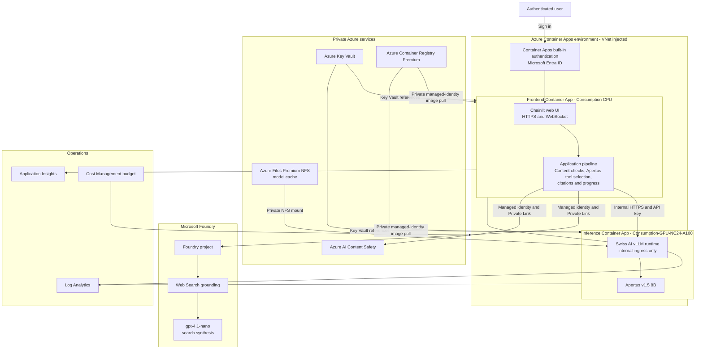

<p align="center">
  <picture>
    <source media="(prefers-color-scheme: dark)" srcset="src/frontend/public/logo_dark.png">
    
  </picture>
</p>

# What is Apertus?

[Apertus](https://www.swiss-ai.org/apertus), Latin for "open," is Switzerland's
open multilingual large-language-model family from the
[Swiss AI Initiative](https://www.swiss-ai.org/). Its training corpus spans
about 15 trillion tokens and more than 1,000 languages, with roughly 40 percent
non-English data. This includes historically underrepresented languages such as
Swiss German and Romansh. The architecture, weights, training documentation,
and recipes are openly published.

This repository deploys the
[`swiss-ai/Apertus-v1.5-8B`](https://huggingface.co/swiss-ai/Apertus-v1.5-8B)
model. It is intended as a transparent building block for multilingual
assistants, translation, education, research, and other applications where open
weights and documented provenance matter.

# Run Apertus on Azure

This project runs Apertus v1.5 8B on an Azure Container Apps serverless NVIDIA
A100 workload profile. A separate Chainlit Container App provides the web
experience, Microsoft Entra authentication, safety checks, adaptive web
grounding, citations, request progress, and operational telemetry.

The implementation adds the security and operational controls needed for a
near-production-ready MVP. It is still an accelerator, not a production
certification: validate capacity, regional availability, safety thresholds,
data-boundary requirements, load, recovery objectives, and organizational
policies before serving production traffic.

## Prerequisites

- [Azure CLI](https://learn.microsoft.com/cli/azure/install-azure-cli) 2.54 or
  newer, [Azure Developer CLI](https://learn.microsoft.com/azure/developer/azure-developer-cli/install-azd),
  Git, Docker, and OpenSSL on POSIX systems.
- An Azure subscription where you can create resources, role assignments,
  private endpoints, private DNS zones, and a delegated Container Apps subnet.
- `Consumption-GPU-NC24-A100` quota in Sweden Central for one 8B inference
  replica.
- Global Standard quota for `gpt-4.1-nano` in Sweden Central.
- A Hugging Face account that has accepted the Apertus model terms and a
  read-only token.
- Permission to create and update a single-tenant Microsoft Entra app
  registration used by Container Apps built-in authentication.
- An operations email address for Azure Monitor and budget notifications.
- Acceptance of the Grounding with Bing data-boundary terms. Search data can
  leave Azure compliance and geographic boundaries and is not covered by the
  Microsoft Data Protection Addendum.
- Confirmation that the current Sweden Central serverless GPU fleet supports
  the CUDA and NVIDIA driver requirements of the pinned Swiss AI runtime image.

## Architecture



Only the frontend and inference workloads run in Azure Container Apps.
Microsoft Foundry owns the grounding project, Web Search integration, and
`gpt-4.1-nano` deployment. GPT-4.1 nano is used within the Web Search tool to
retrieve public sources and synthesize a concise cited evidence packet. Apertus
runs inside the private GPU Container App, selects and uses tools, and writes
the final answer.

## Apertus 1.5 Native Tools

This deployment exercises Apertus 1.5's native function-calling capability in
the `Tools` chat profile. Apertus chooses the registered tool and produces its
arguments. The application remains the execution boundary: it never gives the
model arbitrary code, shell, network, or unregistered function access.

The request flow is:

1. High-confidence local tasks such as writing, translation, identity, and
   stable facts bypass tool selection for lower latency.
2. For other requests, Apertus receives one registry-generated native
   `select_tool` function whose enum contains the available tool names and,
   when safe, `none`.
3. A deterministic, non-streaming selector round chooses at most one tool and
   emits JSON arguments. Final answer generation remains streamed.
4. The broker rejects unknown names and invalid JSON Schema arguments, applies
   the tool timeout and one-call request limit, executes the allowlisted
   handler, and safety-screens its output.
5. Apertus receives the tool result through standard assistant tool-call and
   `role="tool"` messages, then writes the final answer. Web results retain
   citations and pass Prompt Shield and groundedness checks.

The built-in registry contains three tools:

| Tool | Apertus selects it for | Input | Key controls |
| --- | --- | --- | --- |
| `search_web` | Current, changing, planned, upcoming, priced, status, news, or explicitly verified public information | Standalone query, maximum 500 characters | Foundry Web Search, latest-user context, Prompt Shield, Content Safety, citations, 120-second timeout |
| `calculator` | Deterministic arithmetic | Numeric expression, maximum 200 characters | AST-only operators, bounded complexity/exponents/results, no `eval`, 2-second timeout |
| `get_current_time` | Current clock time or calendar date in a requested timezone | IANA timezone such as `Europe/Zurich` | IANA validation, no external network call, 2-second timeout |

Explicit current or future requests cannot choose `none`. A malformed native
selector payload gets one bounded correction attempt; subsequent invalid,
unknown, or extra calls fail closed. The UI displays `Apertus selected <Tool>`
and telemetry records selection, completion, rejection, and citation counts
without prompt or tool-result bodies.

New read-only tools are added with a name, user-facing label, precise
description, JSON Schema, timeout, call limit, and asynchronous handler. The
orchestration pipeline does not need tool-specific branches. See the
[frontend tool registry](src/frontend/apertus_frontend/tools.py) and
[frontend guide](src/frontend/README.md).

Stable explanations and writing requests skip Web Search. If the preview
groundedness detector is inconclusive after a search, the application retries
once and can return the cited, safety-screened Web Search summary rather than
discard a successful retrieval.

## Azure Services

| Azure service | Documentation | Why it is included |
| --- | --- | --- |
| Azure Container Apps | [Overview](https://learn.microsoft.com/azure/container-apps/overview) and [serverless GPUs](https://learn.microsoft.com/azure/container-apps/gpu-serverless-overview) | Runs the CPU frontend and the isolated A100-backed Apertus inference service with managed scaling and revisions. |
| Microsoft Foundry | [What is Microsoft Foundry?](https://learn.microsoft.com/azure/ai-foundry/what-is-ai-foundry) and [Web Search](https://learn.microsoft.com/azure/foundry/agents/how-to/tools/web-search) | Hosts GPT-4.1 nano and Web Search to retrieve public sources and synthesize the cited evidence packet used by Apertus. |
| Azure AI Content Safety | [Overview](https://learn.microsoft.com/azure/ai-services/content-safety/overview) | Screens user text, images, retrieved evidence, and generated output; detects prompt attacks and reports blocked categories. |
| Azure Container Registry Premium | [Overview](https://learn.microsoft.com/azure/container-registry/container-registry-intro) and [artifact streaming](https://learn.microsoft.com/azure/container-registry/container-registry-artifact-streaming) | Stores private frontend and inference images and accelerates the large inference-image startup path. |
| Azure Files Premium NFS | [NFS file shares](https://learn.microsoft.com/azure/storage/files/files-nfs-protocol) | Persists model and compilation caches without requiring Storage shared-key authentication in the application. |
| Azure Key Vault | [Overview](https://learn.microsoft.com/azure/key-vault/general/overview) | Stores the Hugging Face token, internal vLLM API key, health token, and Entra client secret behind RBAC and Private Link. |
| Azure Virtual Network and Private Link | [Container Apps networking](https://learn.microsoft.com/azure/container-apps/networking) and [Private Link](https://learn.microsoft.com/azure/private-link/private-link-overview) | Isolates runtime traffic and privately connects ACR, Azure Files, Key Vault, Foundry, and Content Safety. |
| Microsoft Entra ID | [Container Apps authentication](https://learn.microsoft.com/azure/container-apps/authentication) | Requires tenant authentication before users can reach the Chainlit application. |
| Managed identities for Azure resources | [Overview](https://learn.microsoft.com/entra/identity/managed-identities-azure-resources/overview) | Removes SDK credentials from containers and grants narrowly scoped access to Foundry, Content Safety, ACR, and Key Vault. |
| Azure Monitor | [Application Insights](https://learn.microsoft.com/azure/azure-monitor/app/app-insights-overview) and [Log Analytics](https://learn.microsoft.com/azure/azure-monitor/logs/log-analytics-overview) | Captures dependency latency, failures, routing decisions, Container Apps logs, and operational alerts without logging prompt bodies. |
| Azure Cost Management | [Budgets](https://learn.microsoft.com/azure/cost-management-billing/costs/tutorial-acm-create-budgets) | Adds resource-group budget notifications for an intentionally expensive GPU workload. |

## Security Measures

The design follows the
[Microsoft Azure Well-Architected security principles](https://learn.microsoft.com/azure/well-architected/security/principles)
and applies least privilege, defense in depth, and private connectivity.

| Security feature | Implementation |
| --- | --- |
| VNet isolation | The Container Apps environment is VNet injected. Apertus inference has internal-only ingress and is reachable only from the frontend over internal HTTPS with an API key. |
| Private endpoints | ACR, Azure Files, Key Vault, Foundry, and Content Safety use approved private endpoints and private DNS zones. |
| User authentication | Container Apps built-in authentication redirects unauthenticated users to a single-tenant Microsoft Entra application. HTTPS is required. |
| Managed identity | The frontend system identity calls Foundry and Content Safety. Separate user-assigned identities receive only `AcrPull` and `Key Vault Secrets User` for platform image pulls and secret references. No `AZURE_CLIENT_ID` selector is injected into the application container. |
| No Storage shared keys | Storage shared-key authorization and public network access are disabled. The model cache uses private Premium NFS rather than an application-held account key. |
| Key Vault protection | Key Vault uses RBAC, purge protection, private access, versionless secret references, and no application secrets in images or committed parameters. |
| Hardened registry | ACR admin, anonymous access, exports, and public networking are disabled at rest. Deployment opens a short authenticated build window and closes it before verification. Runtime pulls use managed identity over Private Link. |
| Safety boundary | Input, image, evidence, and output checks run before content reaches the browser. Prompt Shield protects retrieved evidence from indirect prompt injection. Unsafe content remains a hard block. |
| Tool and grounding boundary | Apertus selects among allowlisted schemas. The broker validates arguments, limits execution, safety-screens outputs, preserves citations, and rejects unknown tools or uncited fallback evidence. |
| Secret handling | Sensitive bootstrap values enter as secure ARM parameters, are stored in Key Vault, and are cleared from the local azd environment after initialization. |
| Observability privacy | Structured telemetry records stage, duration, result, category, and correlation identifiers, but not raw prompts, attachments, evidence, answers, tokens, or secrets. |

Raw audio is the explicit safety exception: MIME type and size are validated,
but Azure AI Content Safety does not inspect its spoken content in this design.
Do not enable audio where policy requires audio moderation.

## Deploy Apertus v1.5 8B to Azure Container Apps

This repository implements one deployment target only:
`swiss-ai/Apertus-v1.5-8B` on Azure Container Apps serverless A100 GPU. It does
not include VM, AKS, or 70B deployment instructions.

Authenticate and create the single-tenant Entra application used by the
frontend:

```powershell
az login
azd auth login

$tenantId = az account show --query tenantId -o tsv
$clientId = az ad app create `
  --display-name apertus-chainlit `
  --sign-in-audience AzureADMyOrg `
  --query appId -o tsv
az ad sp create --id $clientId
$clientSecret = az ad app credential reset `
  --id $clientId `
  --display-name apertus-container-app `
  --query password -o tsv
```

Create and configure the azd environment. Replace every angle-bracket value:

```powershell
azd env new <environment-name>
azd env set AZURE_SUBSCRIPTION_ID <subscription-id>
azd env set AZURE_RESOURCE_GROUP <resource-group>
azd env set AZURE_LOCATION swedencentral
azd env set APERTUS_MODEL_REVISION <hugging-face-commit-sha>
azd env set ACCEPT_APERTUS_LICENSE true
azd env set ACCEPT_BING_GROUNDING_TERMS true
azd env set HF_TOKEN <read-only-hugging-face-token>
azd env set ENTRA_TENANT_ID $tenantId
azd env set ENTRA_CLIENT_ID $clientId
azd env set ENTRA_CLIENT_SECRET $clientSecret
azd env set ALERT_EMAIL <operations-email>
azd env set MONTHLY_BUDGET_AMOUNT 500

azd up
```

The hooks build the pinned inference image in ACR, verify artifact-stream
conversion before promotion, initialize Key Vault references, configure Entra
authentication, deploy the frontend, close the ACR build window, and prewarm the
model when a local health token is available. A failed artifact conversion never
updates the inference app.

The Hugging Face and Entra bootstrap values are held only in the ignored local
azd environment long enough to pass them as secure ARM parameters. They are
cleared after initialization. Existing Key Vault secret versions are preserved
on later deployments. For an intentional rotation, set
`ROTATE_APPLICATION_SECRETS=true` and provide fresh source credentials.

## Validate Locally

```powershell
Set-Location src/frontend
uv sync --dev
uv run pytest
uv run python -m compileall app.py apertus_frontend
Set-Location ../..

az bicep build --file infra/main.bicep
bash -n infra/hooks/*.sh src/inference/docker-entrypoint.sh
bash infra/hooks/tests/postprovision-test.sh

docker build --check --file src/frontend/Dockerfile src/frontend
docker build --check --file src/inference/Dockerfile src/inference
```

Running the frontend locally requires Content Safety, Foundry, and an
OpenAI-compatible Apertus endpoint. See
[the frontend guide](src/frontend/README.md).

## Operations and Cleanup

- [Inference runtime](src/inference/README.md)

The deployment includes an email action group, a monthly resource-group budget,
frontend timeout alerts, and inference restart alerts. Admission control limits
each authenticated principal to six requests per minute and four concurrent
requests per frontend replica.

To remove the environment, verify the selected azd environment and subscription,
then run:

```powershell
azd down --purge
```

## License

This project is licensed under the [MIT License](LICENSE). Assets copied from the
Azure Samples Swiss LLM quickstart retain their original
[MIT license and attribution](src/frontend/public/LICENSE.azure-samples.md).

## Citation

If this project is useful in research, a publication, a demo, or another
implementation, please cite the Apertus model and acknowledge this Azure
implementation and its project team.

```bibtex
@misc{swissai2025apertus,
  title={{Apertus: Democratizing Open and Compliant LLMs for Global Language Environments}},
  author={Apertus Team},
  year={2025},
  howpublished={\url{https://huggingface.co/swiss-ai/Apertus-v1.5-8B}}
}

@software{sodano2026apertusazure,
  title={Apertus 1.5 8B on Azure Container Apps},
  author={Francesco Sodano and Dominique Broeglin},
  year={2026},
  url={https://github.com/francesco-sodano/aca-apertus1.5-8B}
}
```

For reproducibility, also record the exact `swiss-ai/Apertus-v1.5-8B` commit
configured through `APERTUS_MODEL_REVISION`.

## Content Owners and Attribution

- [Francesco Sodano](https://github.com/francesco-sodano)
- [Dominique Broeglin](https://github.com/dbroeglin)

The visual assets under `src/frontend/public` originate from the
[Azure Samples Swiss LLM quickstart](https://github.com/Azure-Samples/swiss-llm-quickstart/tree/feature/frontend/src/frontend/public).
